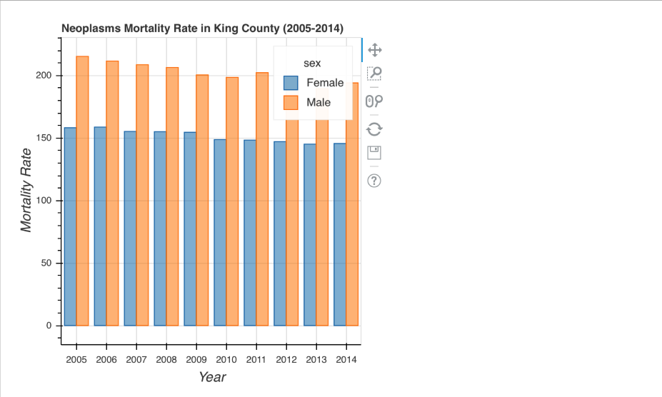

# Exercise-2
In this exercise, you will use the `rbokeh` package to create a grouped bar chart of cancer (neoplasm) mortality rates in King County, Washington using data from [IHME](http://www.healthdata.org/). 

Follow the instructions in the `exercise.R` file to create the graphic below:

Follow See the `solution` branch for solutions. 
