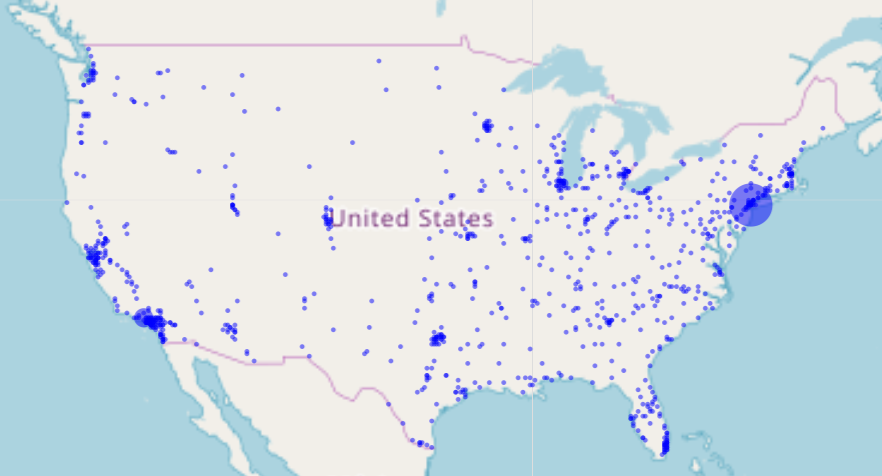

# Exercise-3
In this exercise, you will use the `leaflet` package to create a map of U.S. cities (sized by population), downloaded from [simplemaps.com](https://simplemaps.com/data/us-cities).

Follow the instructions in the `exercise.R` file to create the graphic below:

Follow See the `solution` branch for solutions. 
