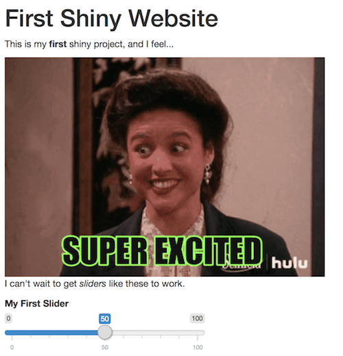

# Exercise 1
In this exercise, you'll practice building a simple Shiny user interface (UI). It will be connected to a server, but the server won't do anything. When finished, it will look something like:

To complete the exercise, open the `exercise-1/app.R` file in RStudio, and follow the instructions there.
