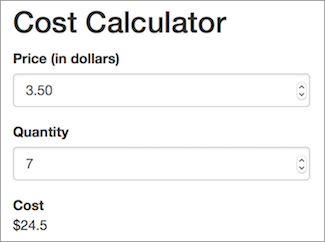

# Exercise 2
In this exercise, you'll practice building a simple Shiny application with a UI and Server by creating an interactive cost calculator:

To complete the exercise, open the `exercise-2/app.R` file in RStudio, and follow the instructions there.
