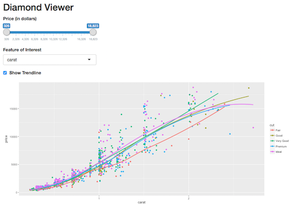

# Exercise 3
In this exercise, you'll practice building a Shiny application with more extensive communication between the U and server. The final product will be a plot of the `diamonds` data set exploring the influence of different features on price:

To complete the exercise, open the `exercise-3/app.R` file in RStudio, and follow the instructions there.
