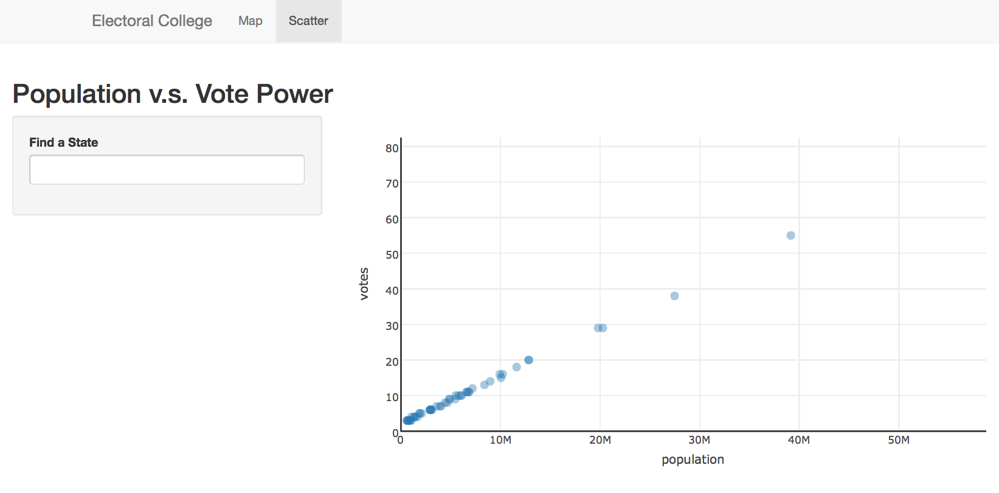

# Exercise 7
In this exercise, you'll practice building an a multi-tab Shiny application. The final product should look like this:

The Map panel is already built for you to model. Your scatter panel should enable users to search for a state in the scatterplot.

As in previous exercises, you should fork and clone this repository, then follow the instructions below.

## server.R
Your `server.R` file already loads the data you need, as well as scripts for building a map and a scatter plot. Inside your `shinyServer`, you should do the following:

- Create a `scatter` property on your `output` object. That property should be a `renderPlotly` object that returns a scatterplot (`build_scatter`)
- Make sure to pass your data and search string (i.e., `input$search`) to your `build_scatter` function.

## ui.R
Your `ui.R` file already has a `tabPanel` built displaying your map. In this section, you should add another `tabPanel` for your scatter-plot by doing the following:

- Create a `tabPanel` to show your scatter plot
- Add a `titlePanel` to your tab
- Create a `sidebarLayout` for this tab (page)
- Create a `sidebarPanel` for your controls
- In your `sidebarPanel`, make a `textInput` widget for searching for a state in your scatter plot
- Create a `mainPanel`, in which you should display your plotly Scatter plot
